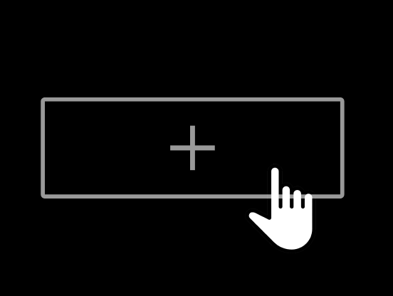

# Project 8: Around The U.S.

## Project Features

-HTML5
-CSS
-Figma design
-Responsive design
-grid containers

**Intro**

This is the start of the Around The U.S. project for Sprint 3 at Practicum. This project was created from a Figma design and is made so all the elements are displayed correctly on popular screen sizes.

**Figma**

- [Link to the project on Figma](https://www.figma.com/file/ii4xxsJ0ghevUOcssTlHZv/Sprint-3%3A-Around-the-US?node-id=0%3A1)

**GitHub**

- [Link to the project on GitHub](https://kaylieryan.github.io/se_project_aroundtheus/)

**Images**

**Author**

Kaylie Ryan

**Acknowledgments**

Thanks to the Practicum by Yandex team for providing the Figma design and guidance for this project.
